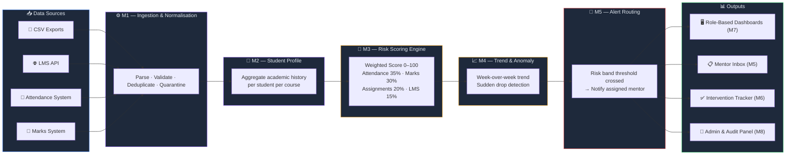

# Academic Risk Radar 🎓📡

> An academic early-warning platform that consolidates student risk signals from attendance, marks, assignments, and LMS data — surfacing at-risk students early so mentors can intervene before it's too late.

Built as a **TypeScript monorepo** using **Next.js**, **Node.js**, and **MongoDB**, with an explainable weighted scoring engine and role-based dashboards for students, mentors, HODs, deans, and admins.

---

## 🌟 Key Features

| Feature | Description |
|---|---|
| 🔢 **Automated Risk Scoring** | Weighted engine combining attendance, marks, assignments & LMS activity into a single risk band |
| 📈 **Trend & Anomaly Detection** | Identifies sudden drops or persistent decline patterns week-over-week |
| 🔔 **Smart Alert Routing** | Notifies the right mentor automatically when a student crosses a risk threshold |
| 📋 **Intervention Tracking** | Mentors log follow-ups; outcomes are tracked to measure effectiveness |
| 🖥️ **Role-Based Dashboards** | Tailored views for Students, Mentors, Instructors, HODs, Deans, and Admins |
| 🔍 **Explainable Scoring** | Every risk score breaks down its contributing factors transparently |

---

## 🏗️ Tech Stack

| Layer | Technology |
|---|---|
| **Frontend** | Next.js 14 (App Router), TypeScript |
| **Backend API** | Node.js + Express, TypeScript |
| **Database** | MongoDB (via Mongoose) |
| **Scoring Engine** | Pure TypeScript (zero framework dependencies) |
| **Shared Types** | `@academic-risk-radar/shared-types` monorepo package |
| **Containerization** | Docker Compose |
| **Monorepo Tool** | npm Workspaces |

---

## 🔄 System Architecture & Data Flow



---

## 📁 Project Structure

```
academic-risk-radar/
├── apps/
│   ├── api/                        # Node.js + Express REST API
│   │   └── src/
│   │       ├── server.ts           # Express app entry point
│   │       ├── auth/               # JWT authentication & RBAC middleware
│   │       ├── db/                 # MongoDB connection & Mongoose models
│   │       └── modules/            # Feature modules (one per domain)
│   │           ├── ingestion/      # M1 — CSV/LMS data ingestion & normalisation
│   │           ├── profile/        # M2 — Student academic profile aggregation
│   │           ├── scoring/        # M3 — Risk scoring engine integration
│   │           ├── trends/         # M4 — Trend & anomaly detection
│   │           ├── alerts/         # M5 — Alert routing & mentor inbox
│   │           ├── interventions/  # M6 — Intervention & outcome tracking
│   │           ├── analytics/      # M7 — Dashboards & reporting endpoints
│   │           └── admin/          # M8 — Configuration & audit control
│   │
│   ├── web/                        # Next.js 14 frontend (App Router)
│   │   └── app/
│   │       ├── layout.tsx          # Root layout
│   │       ├── page.tsx            # Landing / login page
│   │       ├── (student)/          # Student self-service dashboard
│   │       ├── (mentor)/           # Mentor inbox & intervention views
│   │       ├── (instructor)/       # Instructor-facing course views
│   │       ├── (hod)/              # Head of Department overview
│   │       ├── (dean)/             # Dean institutional dashboard
│   │       └── (admin)/            # Admin configuration & audit
│   │
│   └── workers/                    # Background job workers (scheduled scoring runs)
│
├── packages/
│   ├── shared-types/               # Canonical TypeScript interfaces & enums
│   ├── scoring-engine/             # Pure deterministic scoring algorithm
│   └── config/                     # Shared ESLint / TypeScript configs
│
├── docs/                           # Project documentation
│   ├── build-plan.md               # System architecture & module ownership
│   ├── stage-wise-development-plan.md  # Stage-by-stage dev checklist
│   ├── api-contract.md             # REST API specification & RBAC rules
│   ├── model-specification.md      # Scoring weights & risk band thresholds
│   └── glossary.md                 # Canonical domain terminology
│
├── infra/
│   └── docker-compose.yml          # MongoDB + API + Web local dev stack
│
├── .ai-rules/                      # AI assistant configuration files
├── package.json                    # Monorepo root (npm workspaces)
└── tsconfig.json                   # Root TypeScript configuration
```

---

## 🔑 Risk Scoring Model

The scoring engine computes a **composite risk score (0–100)** from four weighted signal groups:

| Signal | Weight |
|---|---|
| Attendance rate | **35%** |
| Assessment marks | **30%** |
| Assignment submission rate | **20%** |
| LMS activity / engagement | **15%** |

**Risk Bands:**

| Band | Score Range | Status |
|---|---|---|
| Low | 0 – 39 | 🟢 All good |
| Medium | 40 – 59 | 🟡 Monitor closely |
| High | 60 – 79 | 🔴 Mentor alert sent |
| Critical | 80 – 100 | 🚨 Urgent intervention required |

> Scores are recomputed every week. Each score includes a breakdown of contributing factors so mentors understand *why* a student is at risk.

---

## 👥 Module Ownership

| Module | Description | Owner | Branch |
|---|---|---|---|
| **M1** | Ingestion & Normalisation | Nilesh | `feat/m1-ingestion` |
| **M2** | Student Academic Profile | Nilesh | `feat/m2-profile` |
| **M3** | Risk Scoring Engine | Pawan | `feat/m3-scoring` |
| **M4** | Trend & Anomaly Detection | Vani | `feat/m4-trends` |
| **M5** | Alert Routing & Mentor Inbox | Vani | `feat/m5-alerts` |
| **M6** | Intervention & Outcome Tracking | Piyush Kumar Singh | `feat/m6-interventions` |
| **M7** | Dashboards & Reporting | Piyush Kumar Singh | `feat/m7-analytics` |
| **M8** | Configuration & Audit Control | Pawan | `feat/m8-admin` |

---

## 🚀 Getting Started

### Prerequisites
- **Node.js** v20+ / v22+
- **npm** v10+
- **Docker** (for local MongoDB via Docker Compose)

### Setup

```bash
# Clone the repository
git clone https://github.com/pawannyadav05/academic-risk-radar.git
cd academic-risk-radar

# Install all workspace dependencies
npm install

# Build the shared types package
npm run build --workspace=packages/shared-types

# Verify TypeScript across the monorepo
npm run typecheck

# Start local services (MongoDB, API, Web)
docker compose -f infra/docker-compose.yml up -d
```

---

## 🌿 Git Workflow

All development happens on **feature branches** — direct commits to `main` are not permitted.

```bash
# 1. Sync latest main
git checkout main && git pull origin main

# 2. Create your feature branch
git checkout -b feat/m3-scoring

# 3. Develop, commit, and push
git commit -m "feat(m3): implement weighted risk score computation"
git push origin feat/m3-scoring

# 4. Open a Pull Request on GitHub → Pawan reviews & merges into main
```

---

## 📚 Documentation

Full project documentation is in the [`docs/`](docs/) folder:

| Document | Description |
|---|---|
| [`build-plan.md`](docs/build-plan.md) | Architecture, module boundaries & API contracts |
| [`stage-wise-development-plan.md`](docs/stage-wise-development-plan.md) | Stage-by-stage dev checklist |
| [`api-contract.md`](docs/api-contract.md) | REST endpoint specification & RBAC rules |
| [`model-specification.md`](docs/model-specification.md) | Scoring weights & risk band thresholds |
| [`glossary.md`](docs/glossary.md) | Canonical domain terminology |

---

<p align="center">Made with ❤️ by Team Academic Risk Radar</p>
